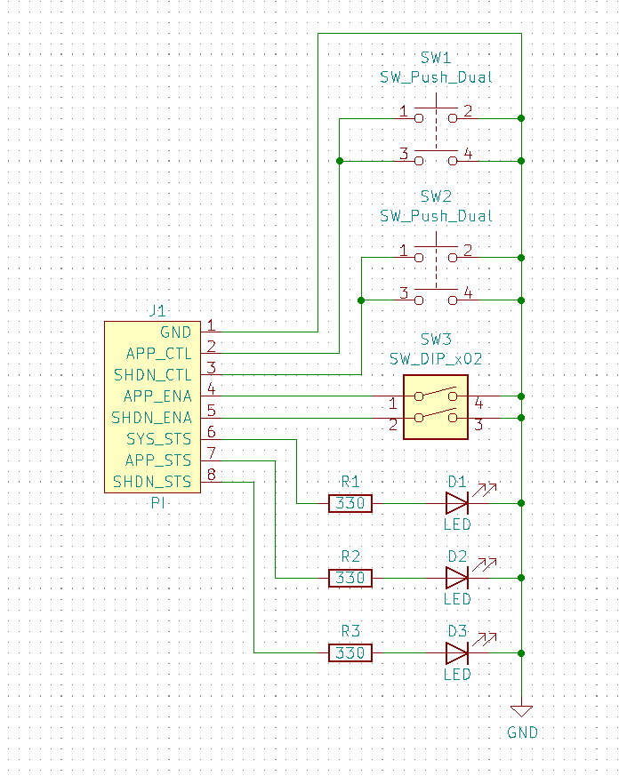

# Description

RunHeadless is a python script that permits application and shutdown control on a
Raspberry Pi via GPIO pins, thus avoiding the need for a keyboard and monitor or
SSH login.  The following features are supported:

1. Launch or terminate an application when a GPIO transitions to low.  If the 
application is not running, launch it.  If the application is already running, 
terminate it.  The GPIO should be connected to ground via a momentary contact 
switch.

2. Shutdown the CPU when a GPIO transitions to low.  The GPIO should be connected to 
ground via a momentary contact switch.

3. Enable/disable application launch and terminate control via a GPIO.  The GPIO 
should be connected to ground via a toggle switch.

4. Enable/disable CPU shutdown control via a GPIO.  The GPIO should be connected to 
ground via a toggle switch.

5. Request graceful application shutdown signaled by the creation of a "flag" file 
recognized by the application.

6. Provide periodic status via GPIO signals (to flash LEDs) for
   a) monitoring service running
   b) application running
   c) system shutdown

# Installation Instructions

These instructions assume that runheadless.py is located in /home/pi/RunHeadless.

1. Copy runheadless.sh to directory /usr/local/bin.

2. Make sure runheadless.sh is executable with

      sudo chmod 755 /usr/local/bin/runheadless.sh

3. Copy runheadless.service to directory /lib/systemd/system.

4. Use the following to enable the service on startup.

      sudo systemctl enable runheadless

5. To check status after startup, use

      sudo systemctl status runheadless

6. To stop the service, use

      sudo systemctl stop runheadless

7. To restart the service, use

      sudo systemctl start runheadless

# Hardware Example

(NOTE: The connector pin numbers below do not represent Raspberry Pi pins.  Refer to runheadless.py to map signal names to Raspberry Pi pins.)
